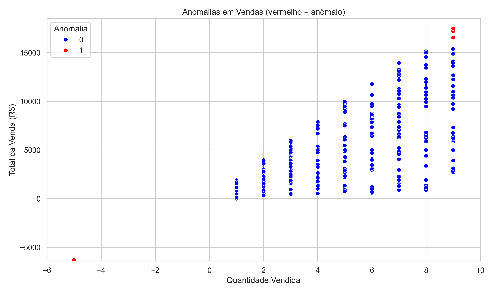
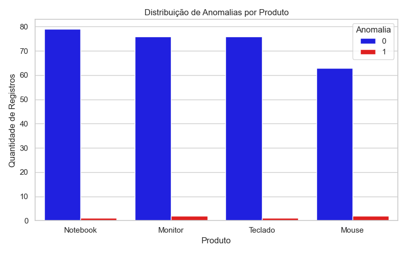

# 🧠 Mini Agente de IA para Detecção de Anomalias em Dados de Vendas

Este projeto simula um agente de Inteligência Artificial capaz de identificar anomalias em dados de vendas, utilizando o algoritmo Isolation Forest.

---

## 🚀 Tecnologias usadas

- Python
- Pandas
- NumPy
- Scikit-learn (Isolation Forest)
- Matplotlib & Seaborn

---

## 🔍 O que o projeto faz

- Gera dados simulados de vendas
- Insere anomalias manualmente (valores fora do padrão)
- Aplica IA para detectar essas anomalias
- Exibe os dados anômalos
- Gera e salva dois gráficos:
  - Dispersão (quantidade × total da venda)
  - Barras (distribuição de anomalias por produto)

---

## 📊 Exemplo de resultado




---

## 🧪 Como rodar

1. Clone este repositório:
   ```bash
   git clone https://github.com/Alice-Nascimento/detector-anomalias-vendas.git